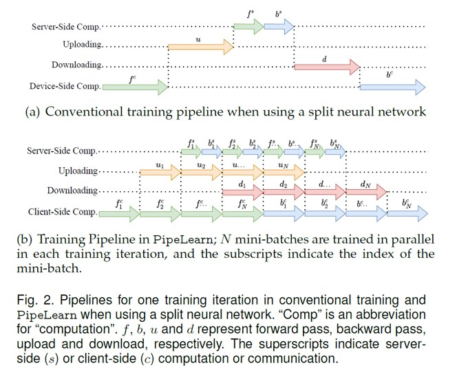

# **PiPar**: Pipeline Parallelism for Collaborative Machine Learning

## Introduction

Collaborative machine learning (CML) techniques, such as federated learning, were proposed to collaboratively train deep learning models using multiple end-user devices and a server. CML techniques preserve the privacy of end-users as it does not require user data to be transferred to the server. Instead local models are trained and shared with the server. However, the low resource utilisation of CML techniques makes the training process inefficient, thereby limiting the use of CML in the real-world. Idling resources both on the server and devices due to sequential computation and communication is the principal cause of low resource utilisation. A novel framework **PiPar** that leverages pipeline parallelism for CML techniques is developed to substantially improve resource utilisation. A new training pipeline is designed to parallelise the computations on different hardware resources and communication on different bandwidth resources, thereby accelerating the training process in CML.

**PiPar** redesigns the training process of DNNs. Traditionally, training a DNN involves the forward propagation pass (or forward pass) and backward propagation pass (or backward pass). In the forward pass, one batch of input data (also known as a mini-batch) is used as input for the first input layer and the output of each layer is passed on to subsequent layers to compute the loss function. In the backward pass, the loss function is passed from the last DNN layer to the first layer to compute the gradients of the DNN model parameters. 

**PiPar** divides the DNN into two parts and deploys them on the server and devices. Then the forward and backward passes are reordered for multiple mini-batches. Each device executes the forward pass for multiple mini-batches in sequence. The immediate result of each forward pass (smashed data or activations) is transmitted to the server, which runs the forward and backward passes for the remaining layers and sends the gradients of the activations back to the device. The device then sequentially performs the backward passes for the mini-batches. The devices operate in parallel, and the local models are aggregated at a set frequency. Since many forward passes occur sequentially on the device, the communication for each forward pass overlaps the computation of the following forward passes. Also, in **PipeLearn**, the server and device computations occur simultaneously for different mini-batches. Thus, **PipeLearn** reduces the idle time of devices and servers by overlapping server and device-side computations and server-device communication.

<div align=center>

</div>

The above figure shows a training iteration in conventional split learning and **PipeLearn**. Computation and communication are overlapped in the training pipeline in **PipeLearn**. Compared with conventional split learning, the idle time in **PipeLearn** is significantly reduced.

## Code Instruction

### Environment Setup

This is a Python project and the recommended python version is python3.6.
The dependency required for this project are listed in requirement.txt. You can install the dependency by

```
pip install -r requirements.txt
```

Collaborative machine learning requires a server and multiple devices. They all need the above environment. The dataset used is CIFAR-10, which will be downloaded automatically the first time the code is run.
### Configuration

Before running the code, you need to personalise the config.json file. The file is in form of JSON and the meaning of items are listed below.

| Config Item           | Type   | Description                                                                                                                              |
|-----------------------|--------|------------------------------------------------------------------------------------------------------------------------------------------|
| experiment_name       | string | The name of this experiments, e.g. "test01".                                                                                             |
| server_address        | string | The server IP address.                                                                                                                   |
| port                  | int    | The port of server.                                                                                                                      |
| client_num            | int    | The number of devices involved.                                                                                                          |
| dataset_name          | string | The dataset on which the model is trained. Available datasets include "CIFAR-10", "MNIST" and "SVHN".                                    |
| model_name            | string | The deep learning models. Available models include "VGG5", "VGG11", "VGG16", "ResNet18", "ResNet50", "MobileNetSmall", "MobileNetLarge". |
| data_size             | int    | The size of training data for each device.                                                                                               |
| test_data_size        | int    | The size of test data.                                                                                                                   |
| epoch_num             | int    | The epoch number of training.                                                                                                            |
| aggregation_frequency | int    | The number of training rounds at the end of which the aggregation happens. "-1" represent aggregation happens at the end of each epoch.  |
| batch_size            | int    | The size of data batch used in each training round.                                                                                      |
| enable_val            | bool   | Whether calculate validation accuracy when training.                                                                                     |
| enable_test           | bool   | Whether calculate test accuracy at the end of training.                                                                                  |
| layer_num_on_client   | int    | How many layers deployed at the device side.                                                                                             |
| pipe_batch_num        | int    | How many batches are used in parallel in each training round.                                                                            |
| profile_iter_num      | int    | How many training iteration the profiler takes to determine layer_num_on_client and pipe_batch_num. Set it to 0 to disable the profiler. |
| uplink_bandwidth      | int    | The uplink network bandwidth (Mbps).                                                                                                     |
| downlink_bandwidth    | int    | The downlink network bandwidth (Mbps).                                                                                                   |

### Running the Code

You need to start the project on the server first, and then start the project on devices.

Running on server:

```
python run.py -s
```

where -s means the code is running on server.

Running on device:

```
python run.py -i {device_index}
```

where -i represent the index of current device which starts from 0.

### Results

The results, including model accuracy, training time, idle time, etc., are saved in results/results.csv and also printed on screen.

## Citation

Zihan Zhang, Philip Rodgers, Peter Kilpatrick, Ivor Spence, Blesson Varghese. 2024. “PiPar: Pipeline Parallelism for Collaborative Machine Learning.” Journal of Parallel and Distributed Computing, Vol. 193, Article 104947.

```
@article{zhang2024pipar,
  title         = {PiPar: Pipeline parallelism for collaborative machine learning},
  author        = {Zhang, Zihan and Rodgers, Philip and Kilpatrick, Peter and Spence, Ivor and Varghese, Blesson},
  journal       = {Journal of Parallel and Distributed Computing},
  year          = {2024},
  volume        = {193},
  pages         = {104947},
  url           = {https://www.sciencedirect.com/science/article/pii/S0743731524001114}
}
```
